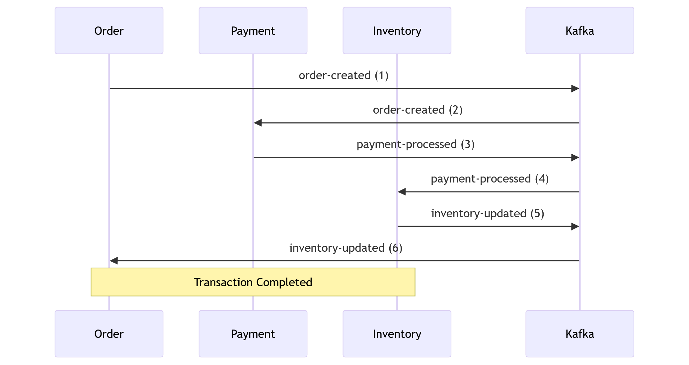
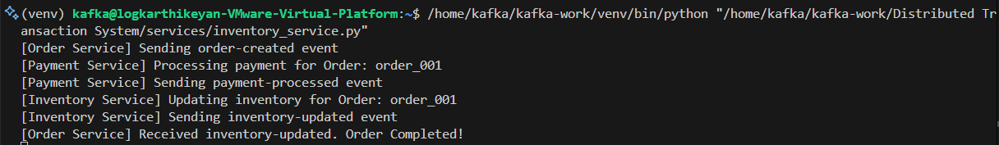

# Kafka Saga Pattern Implementation

## Overview

This project demonstrates the implementation of the Saga pattern using Kafka for handling distributed transactions. The Saga pattern ensures consistency across distributed services by coordinating a series of local transactions using events. 

The application consists of three microservices:
- **Order Service**
- **Payment Service**
- **Inventory Service**

Each service communicates asynchronously through Kafka topics to ensure decoupling and scalability.

---

## What is the Saga Pattern in Kafka?

The Saga Pattern is a microservice architecture pattern used to manage distributed transactions without using two-phase commit (2PC), which can be blocking and hard to scale.

In the Kafka-based Saga Pattern, services coordinate through asynchronous events published to and consumed from Kafka topics. Each step in a business process is handled by a different microservice, and if one step fails, a compensating action is triggered to undo the previous steps.

---

## Saga Pattern with Kafka (Choreography Style)

In choreography, there's no central orchestrator. Services react to events and emit subsequent events.

### Example: E-commerce Order Flow

1. **Order Service**: Creates an order and emits `order-created` to Kafka.
2. **Payment Service**: Listens to `order-created`, processes payment, and emits `payment-processed`.
3. **Inventory Service**: Listens to `payment-processed`, reserves stock, and emits `inventory-updated`.
4. **Order Service**: Listens to `inventory-updated`, marks the order as complete.

---

## Architecture




### Workflow

1. **Order Service**:
   - Publishes an `order-created` event to Kafka.
   - Listens for the `inventory-updated` event to mark the order as completed.

2. **Payment Service**:
   - Listens for the `order-created` event.
   - Processes the payment and publishes a `payment-processed` event.

3. **Inventory Service**:
   - Listens for the `payment-processed` event.
   - Updates the inventory and publishes an `inventory-updated` event.

---

## Folder Structure


```
Distributed Transaction System/
├── README.md
├── kafka-setup/
│   ├── create_topics.sh
├── services/
│   ├── kafka_saga_pattern.py
├── images/
│   ├── architecture.png
│   ├── processor_output.png
```


---

## Kafka Topics

1. **`order-created`**: Published by the Order Service when a new order is created.
2. **`payment-processed`**: Published by the Payment Service after payment is processed.
3. **`inventory-updated`**: Published by the Inventory Service after inventory is updated.

---

## Services

### 1. Order Service
- Sends an `order-created` event to Kafka.
- Waits for the `inventory-updated` event to mark the order as completed.

### 2. Payment Service
- Listens for the `order-created` event.
- Processes the payment and sends a `payment-processed` event.

### 3. Inventory Service
- Listens for the `payment-processed` event.
- Updates the inventory and sends an `inventory-updated` event.

---

## How to Run

### Prerequisites
1. **Kafka**:
   - Ensure Kafka is installed and running locally on `localhost:9092`.
2. **Dependencies**:
   - Install the required Python dependency:
     ```bash
     pip install kafka-python
     ```

### Steps to Execute
1. Start the Kafka broker and ensure the required topics (`order-created`, `payment-processed`, `inventory-updated`) are available.
2. Run the script:
   ```bash
   python saga_kafka_saga_pattern.py
   ```
3. The script will:
   - Start all three services (Order, Payment, Inventory) as separate processes.
   - Simulate the order creation, payment processing, and inventory update workflow.

---

## Key Learnings

1. **Saga Pattern**:
   - Ensures distributed transaction consistency through event coordination.
   - Avoids the need for a global transaction manager.

2. **Event-Driven Architecture**:
   - Services communicate asynchronously via events, leading to loose coupling and scalability.

3. **Decentralized State Management**:
   - Each service manages its own state and coordinates through events.

---

## Dependencies

- **Kafka**: Message broker for inter-service communication.
- **[kafka-python](https://github.com/dpkp/kafka-python)**: Python client for Kafka.

---

## Future Enhancements

1. **Error Handling**:
   - Implement compensation logic to handle failures (e.g., roll back inventory updates if payment fails).

2. **Monitoring**:
   - Add monitoring and logging for better observability.

3. **Scalability**:
   - Deploy services in a distributed environment (e.g., Kubernetes) to handle high transaction volumes.

---

### Example Output


