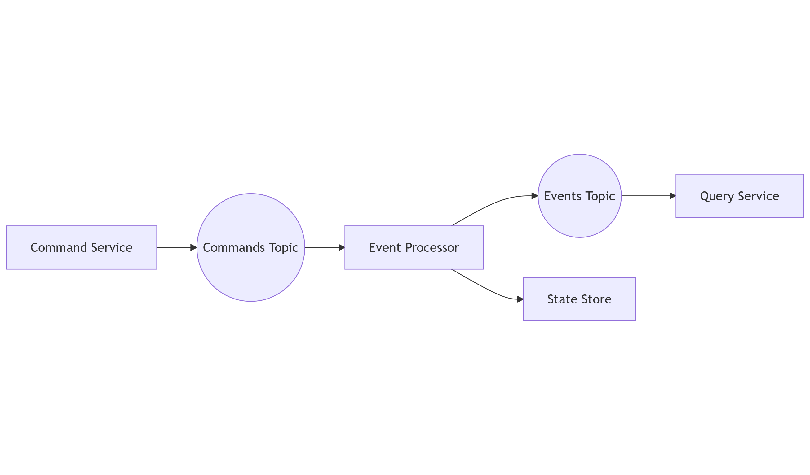
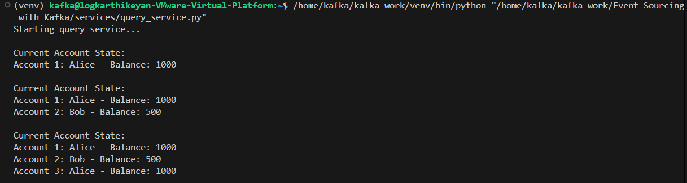
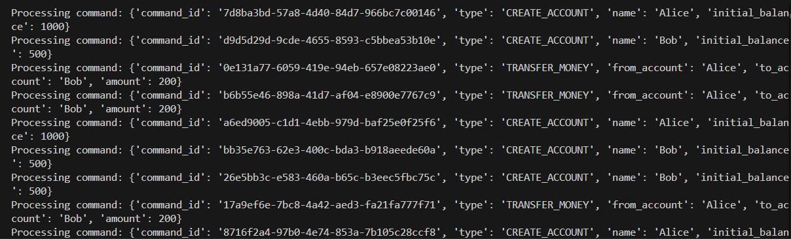

# Event-Sourced Banking System

## Overview

This system implements an event-sourced architecture where all state changes are captured as events in Kafka. It uses Kafka as the central messaging hub and demonstrates the use of event sourcing and Command Query Responsibility Segregation (CQRS) patterns.

## Architecture Diagram



### Components
1. **Command Service**: Handles incoming commands (e.g., `CREATE_ACCOUNT`, `TRANSFER_MONEY`) and sends them to the Kafka commands topic.
2. **Event Processor**: Processes commands, updates the state store, and emits events to the Kafka events topic.
3. **Query Service**: Consumes events, reconstructs the state, and provides query capabilities.

---

## Folder Structure

```
event-sourced-banking-system/
├── README.md
├── kafka-setup/
│   ├── create_topics.sh
├── services/
│   ├── command_service.py
│   ├── event_processor.py
│   ├── query_service.py
├── images/
│   ├── architecture.png
│   ├── processor_output.png
│   ├── query_service_output.png
```

### Folder Details

- **`kafka-setup/`**: Contains scripts for managing Kafka topics.
- **`services/`**: Contains Python scripts for the Command Service, Event Processor, and Query Service.

---

## Setup Instructions

### Prerequisites

1. Install Kafka.
2. Install Python dependencies:
   ```bash
   pip install kafka-python
   ```

---

### Step 1: Create Kafka Topics

Run the following script to create the required Kafka topics:
```bash
bash kafka-setup/create_topics.sh
```

---

### Step 2: Start the Services

1. Start the Command Service:
   ```bash
   python3 services/command_service.py
   ```

2. Start the Event Processor:
   ```bash
   python3 services/event_processor.py
   ```

3. Start the Query Service:
   ```bash
   python3 services/query_service.py
   ```

---

## Key Learnings

1. **Event Sourcing**: Capturing all state changes as a sequence of events enables state reconstruction and auditing.
2. **CQRS Pattern**: Separating command processing and query handling for scalability and maintainability.
3. **State Reconstruction**: Building the current state from a stream of past events.
4. **Complex Event Processing**: Handling multiple event types and maintaining consistency across services.

---

### Example Output




