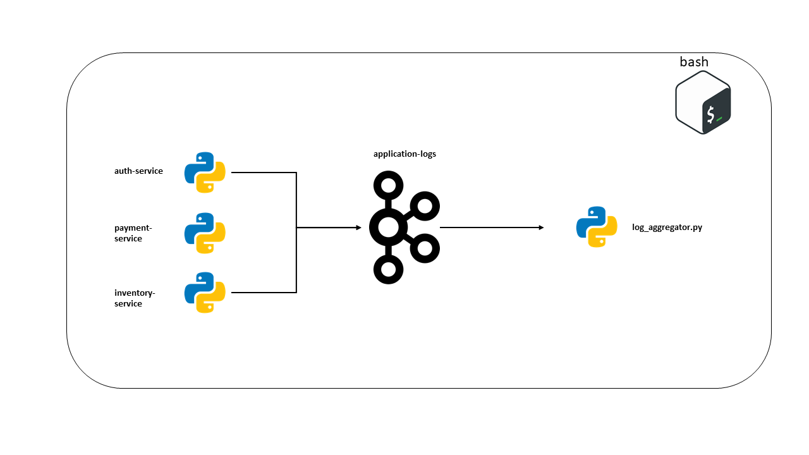
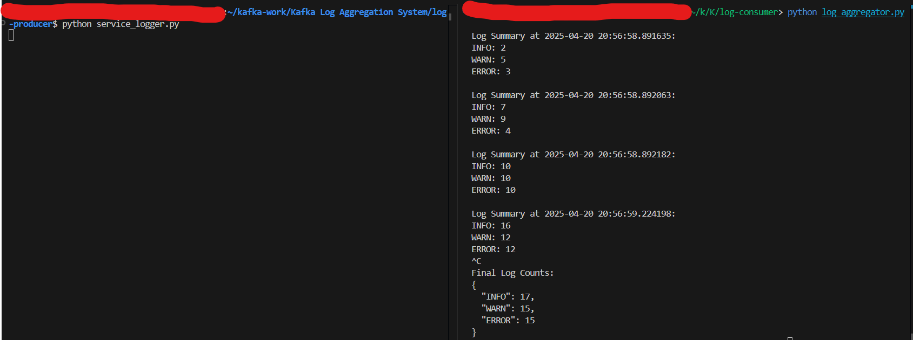

# Kafka Log Aggregation System

## Overview

This project demonstrates a log aggregation system where multiple services send logs to a Kafka topic, and a central consumer aggregates and processes the logs. Logs are categorized by level (`INFO`, `WARN`, `ERROR`) and can be further stored in a database or a file.

## Architecture Diagram



## Folder Structure

```plaintext
.
├── kafka-setup/
│   ├── create-topic.sh
├── log-producer/
│   ├── service_logger.py
├── log-consumer/
│   ├── log_aggregator.py
├── README.md
└── images/
    ├── architecture.png
    ├── log_summary_example.png
```

### Folder Details

1. **kafka-setup/**  
   Contains shell scripts to set up Kafka topics and brokers.  
   - `create-topic.sh`: Script to create the Kafka topic.

2. **log-producer/**  
   Contains the producer application code.  
   - `service_logger.py`: Python script for sending logs to the Kafka topic.

3. **log-consumer/**  
   Contains the consumer application code.  
   - `log_aggregator.py`: Python script for aggregating and processing logs.

4. **images/**  
   Contains screenshots and diagrams related to the project.  
   - `architecture.png`: Diagram of the system architecture.
   - `log_summary_example.png`: Example of log summary output.

---

## Key Learnings

1. **Partitioning with Keys**:
   - Messages are sent to specific partitions based on the hash of the key (e.g., service name).

2. **Consumer Groups**:
   - Multiple consumers can work together to process partitions in parallel.

3. **Basic Message Processing**:
   - Aggregating and categorizing log messages.

---

## Prerequisites

1. **Kafka Installation**:
   - Make sure Kafka is installed and running on your system. Refer to the [Kafka Quickstart Guide](https://kafka.apache.org/quickstart) for setup instructions.

2. **Python Dependencies**:
   Install the `kafka-python` library:
   ```bash
   pip install kafka-python
   ```

---

## How to Run

1. **Setup Kafka Topic**:
   Run the `create-topic.sh` script to create the Kafka topic:
   ```bash
   bash kafka-setup/create-topic.sh
   ```

2. **Start the Log Consumer**:
   Navigate to the `log-consumer` directory and run the consumer script:
   ```bash
   python log-consumer/log_aggregator.py
   ```

3. **Start the Log Producer**:
   Navigate to the `log-producer` directory and run the producer script:
   ```bash
   python log-producer/service_logger.py
   ```

---


### Example Log Summary Output

