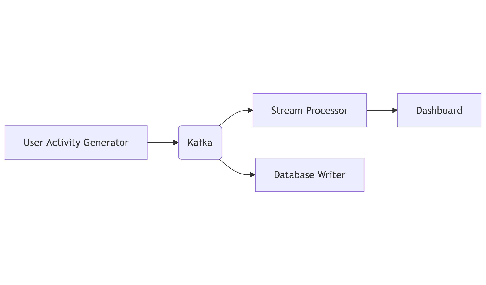
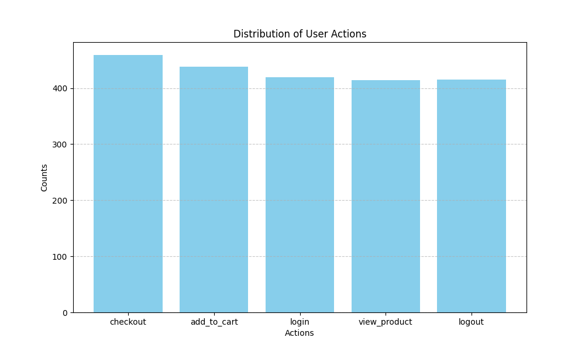

# Real-Time Analytics Dashboard with Kafka

## Overview

This project demonstrates a real-time analytics system, where user activities are streamed to Kafka, processed to calculate metrics, and displayed on a live dashboard. The system also writes aggregated metrics to a secondary topic for further usage or storage.


## Folder Structure

```plaintext
.
├── kafka-setup/
│   ├── create-topics.sh
├── activity-producer/
│   ├── activity_simulator.py
├── stream-processor/
│   ├── analytics_processor.py
├── dashboard/
│   ├── dashboard.py
├── README.md
└── images/
    ├── architecture.png
    ├── user_actions_distribution.png
```

### Folder Details

1. **kafka-setup/**  
   Contains shell scripts to set up Kafka topics and brokers.  
   - `create-topics.sh`: Script to create the Kafka topics `user-events` and `event-metrics`.

2. **activity-producer/**  
   Contains the user activity producer application code.  
   - `activity_simulator.py`: Python script for simulating user activities and sending events to Kafka.

3. **stream-processor/**  
   Contains the stream processor code.  
   - `analytics_processor.py`: Python script for processing user events and aggregating metrics.

4. **dashboard/**  
   Contains the live dashboard code.  
   - `dashboard.py`: Python script for consuming metrics and displaying them on a live dashboard.

5. **images/**  
   Contains screenshots and diagrams related to the project.  
   - `architecture.png`: Diagram of the system architecture.
   - `user_actions_distribution.png`: Example of the live dashboard output.

---

## Key Learnings

1. **Complex Event Processing**:
   - Handling multiple event types and aggregating metrics in real-time.

2. **Real-Time Aggregation**:
   - Calculating metrics such as active users, total events, and action counts.

3. **Multiple Topic Interaction**:
   - Producing and consuming data across multiple Kafka topics.

4. **Data Visualization**:
   - Displaying real-time data on a live dashboard using Python's `matplotlib`.

---

## Prerequisites

1. **Kafka Installation**:
   - Install and configure Kafka. Refer to the [Kafka Quickstart Guide](https://kafka.apache.org/quickstart) for setup instructions.

2. **Python Dependencies**:
   Install the required Python libraries:
   ```bash
   pip install kafka-python matplotlib
   ```

---

## How to Run

1. **Setup Kafka Topics**:
   Run the `create-topics.sh` script to create the Kafka topics:
   ```bash
   bash kafka-setup/manage_kafka_topics.sh
   ```

2. **Start the Stream Processor**:
   Navigate to the `stream-processor` directory and run the processor script:
   ```bash
   python stream-processor/analytics_processor.py
   ```

3. **Start the Activity Producer**:
   Navigate to the `activity-producer` directory and run the producer script:
   ```bash
   python activity-producer/activity_simulator.py
   ```

4. **Start the Dashboard**:
   Navigate to the `dashboard` directory and run the dashboard script:
   ```bash
   python dashboard/dashboard.py
   ```

---

## Screenshots and Visuals

### Architecture Diagram



### Example Dashboard Output

