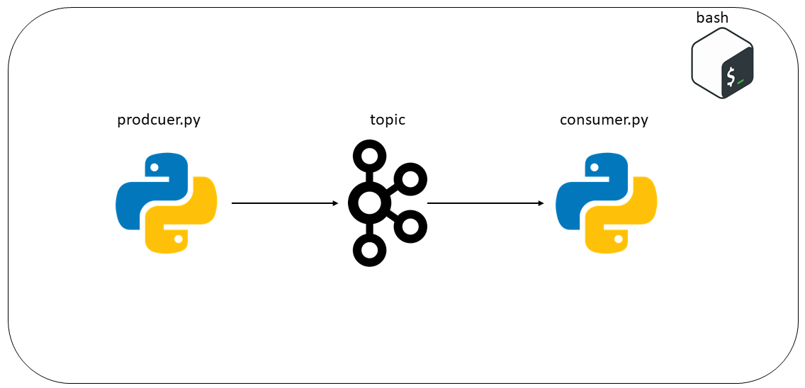
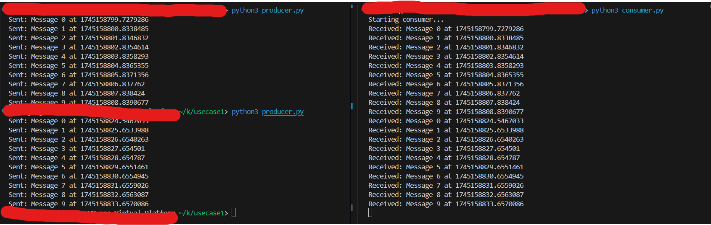

# Kafka Simple Message Producer-Consumer Example

## Overview

This project demonstrates a simple Kafka producer-consumer architecture. A producer sends messages to a Kafka topic, and a consumer reads those messages. It illustrates the basic concepts of Kafka and how to use its Python client.

## Architecture

```

```

## Folder Structure

```plaintext
.
├── kafka-setup/
│   ├── create-topic.sh
├── producer/
│   ├── producer.py
├── consumer/
│   ├── consumer.py
└── README.md
```

### Folder Details

1. **kafka-setup/**  
   Contains shell scripts to set up Kafka topics and brokers.  
   - `create-topic.sh`: Script to create the Kafka topic.

2. **producer/**  
   Contains the producer application code.  
   - `producer.py`: Python script for sending messages to the Kafka topic.

3. **consumer/**  
   Contains the consumer application code.  
   - `consumer.py`: Python script for consuming messages from the Kafka topic.

---

## Key Learnings

1. **Basic producer/consumer setup**:
   - Understanding the roles of producer and consumer in Kafka architecture.

2. **Message serialization**:
   - Encoding and decoding messages for transmission.

3. **Kafka client configuration**:
   - Setting up bootstrap servers and topic configurations in the Python client.

---

## Prerequisites

1. **Kafka Installation**:
   - Make sure Kafka is installed and running on your system. Refer to the [Kafka Quickstart Guide](https://kafka.apache.org/quickstart) for setup instructions.

2. **Python Dependencies**:
   Install the `kafka-python` library:
   ```bash
   pip install kafka-python
   ```

---

## How to Run

1. **Setup Kafka Topic**:
   Run the `create-topic.sh` script to create the Kafka topic:
   ```bash
   bash kafka-setup/create-topic.sh
   ```

2. **Start the Consumer**:
   Navigate to the `consumer` directory and run the consumer script:
   ```bash
   python consumer/consumer.py
   ```

3. **Start the Producer**:
   Navigate to the `producer` directory and run the producer script:
   ```bash
   python producer/producer.py
   ```

You should see messages being sent by the producer and received by the consumer in real-time.

## Output

